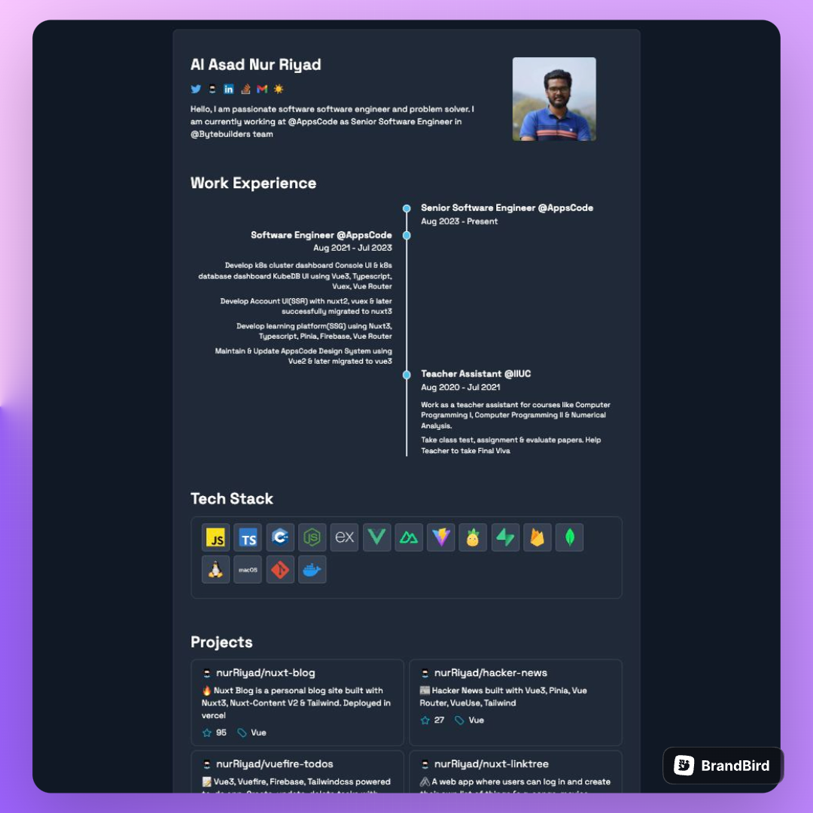

# Personal Portfolio

### Built with

<p align="center">
    
</p>

Hacker News clone built with [Nuxt3](https://nuxt.com), [Vue3](https://vuejs.org) & [TailwindCss](https://tailwindcss.com/)

## Features

- Update all data from one single file `/data/info`
- Get top github project by api call
- Server Side Rendered(SSR) with Nuxt3
- Used Typescript mean fully type safe
- Properly Search Engin optimized
- Use TailwindCss For designing

## Preview

<p align="center">
  <a href="https://nurriyad.com" target="_blank">
    
    <br>
    Live Demo
  </a>
</p>

## Demo

https://nurriyad.com

> Hosted on [Vercel](https://vercel.com/): `npm run build`

## Build Setup

**Requires Node.js 16+**

```bash
# install dependencies
npm install

# serve in dev mode, with hot reload at localhost:5173
npm run dev

# build for production
npm run build

# serve in production mode
npm run  preview

```
