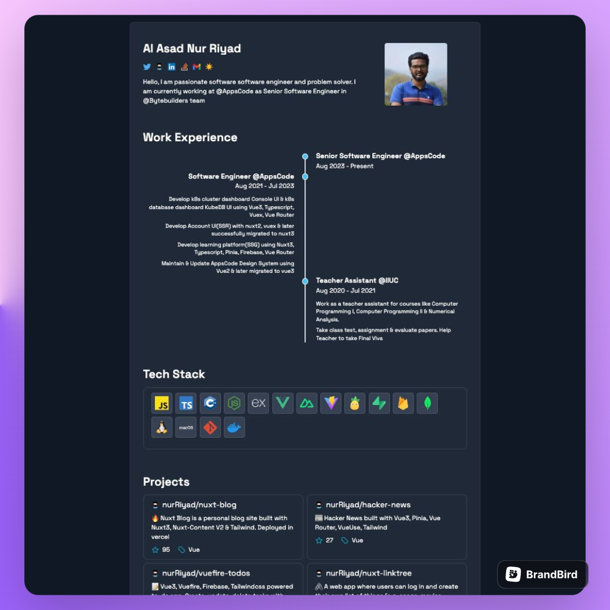

# Personal Portfolio

A Nuxt portfolio for Al Asad Nur Riyad. It presents profile and contact links, recent GitHub activity, work experience, technologies, projects, open-source profiles, programming contests, education, and achievements.

## Built with

- Nuxt 4 and Vue 3
- TypeScript
- Tailwind CSS 4 and Nuxt UI
- Nuxt Image and Iconify
- GitHub API integration for recent activity and projects

## Features

- Profile and social links configured in `app/data/info.ts`
- Recent GitHub activity loaded through a server API
- Project and profile cards for open-source work and competitive programming
- Light and dark themes
- Server-side rendering and search engine metadata

## Preview

<p align="center">
  <a href="https://www.nurriyad.com" target="_blank" rel="noopener noreferrer">
    
    <br>
    Live Demo
  </a>
</p>

## Requirements

- Node.js 24.11.1 or newer
- pnpm 10.24.0 or newer

## Development

```bash
# install dependencies
pnpm install

# start the development server at http://localhost:4000
pnpm dev

# build for production
pnpm build

# preview the production build
pnpm preview
```

## Deployment

The site is configured for deployment on Vercel. Build the app with `pnpm build` before deployment.
